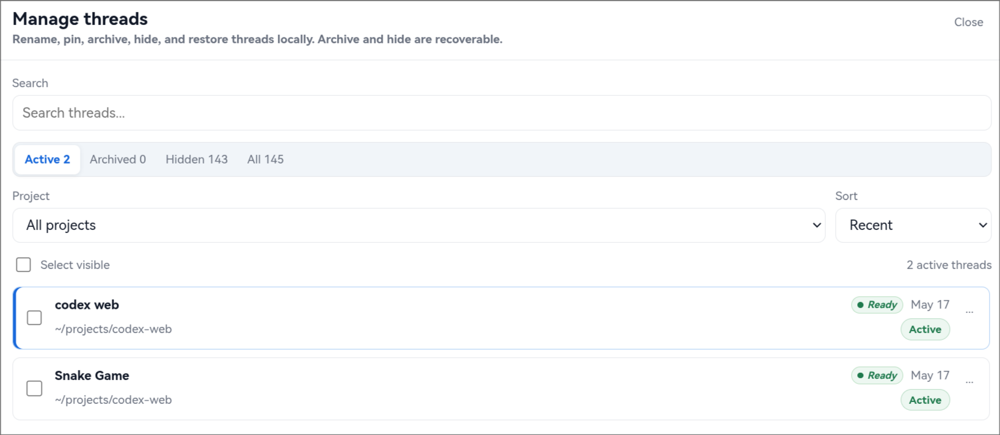
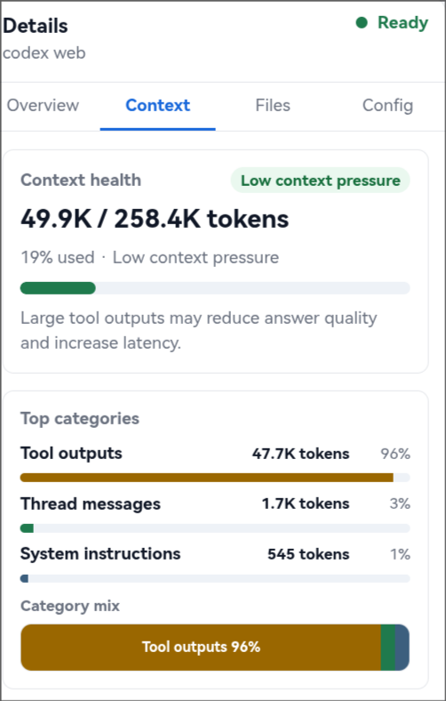

# Codex Web

A local browser workspace for Codex: manage threads, chat with Codex, inspect context, and so on


## Highlights

- Chat with Codex in a local browser workspace.
- Search, rename, pin, archive, hide, and restore threads using local metadata.
- Inspect session status, changed files, running commands, and context usage.
- Review context health and largest context contributors when attribution is available.
- Keep raw diffs visible in the chat flow.

## What This Is

Codex Web is a local web UI for working with Codex threads that already live on your machine. It focuses on day-to-day thread navigation, chat, context inspection, file-change review, and safe AGENTS.md personalization.

## What This Is Not

- It is not a hosted Codex service.
- It is not a replacement for the Codex CLI.
- It does not delete or remotely mutate Codex threads.

## Safety Model

Codex Web is intentionally conservative:

- Thread rename, archive, hide, restore, and pin are local metadata operations.
- Codex Web does not delete Codex threads.
- Codex Web does not call Codex rename/delete/archive APIs.
- Hidden threads can be restored from Manage threads.

## Quick Start

### Requirements

- Python 3.11+
- Codex CLI installed and logged in locally
- Existing local Codex data under `~/.codex`

By default Codex Web reads:

- `~/.codex/state_5.sqlite`
- `~/.codex/sessions`
- `~/.codex/archived_sessions`

### Start The Server

Use the helper script:

```bash
./run.sh start
```

Open:

```text
http://127.0.0.1:3217
```

Common commands:

```bash
./run.sh status
./run.sh restart
./run.sh stop
```

Custom host, port, or Codex home:

```bash
python3 -m codex_threads_manager.server \
  --host 127.0.0.1 \
  --port 3217 \
  --codex-home ~/.codex
```

## Demo

### Workspace

Chat with Codex while keeping thread navigation and session details visible.


### Thread Library

Search, filter, rename, pin, archive, hide, and restore threads locally.



### Context Inspector

See context health, category usage, and largest contributors.



## Features

### Chat Workspace

- Chat with Codex in the current thread.
- Start new threads.
- Attach images when a task needs visual input.
- Compact context.
- Review current code changes.
- Fork threads.
- Keep diffs readable in the chat flow.

### Thread Navigator

The left sidebar is for daily navigation:

- Search active threads.
- Open recent threads.
- Refresh the local thread index.
- Rename threads locally.
- Pin important threads.
- Archive completed threads.
- Hide threads you do not want in the sidebar.

### Manage Threads

Use the Manage threads overlay for broader cleanup:

- View Active / Archived / Hidden / All threads.
- Search historical threads.
- Restore threads from Archived or Hidden.
- Batch archive / hide / restore / pin selected threads.
- Filter by project and sort the list.

### Details Inspector

Use the right-side inspector to review:

- Current status.
- Thread id.
- Context usage.
- Time window remaining.
- Changed files.
- Running command.
- Context contributors.
- Current thread configuration.

### Context Inspector

The Context tab helps explain where context is being spent:

- Overall context health.
- Estimated token usage.
- Category usage.
- Largest contributors when attribution is available.
- Honest fallback states when detailed attribution is unavailable.

### Personalize Codex

Personalize Codex helps convert repeated workflow patterns into reviewable AGENTS.md suggestions.

The flow is review-first:

1. Choose a learning scope: current project, all projects, selected threads, or the last 30 days.
2. Choose whether Active / Archived / Hidden threads are included.
3. Run a temporary analysis task.
4. Review each suggestion.
5. Edit, deselect, ignore, or choose Global / Project AGENTS.md for each rule.
6. Preview the exact diff.
7. Apply changes only after review.

Codex Web never writes AGENTS.md automatically.

## Local Metadata Behavior

Thread management actions are local-only.

| Action  | What happens                               | Codex thread affected? |
| ------- | ------------------------------------------ | ---------------------- |
| Rename  | Updates local `displayName`                | No                     |
| Pin     | Updates local metadata                     | No                     |
| Archive | Moves thread out of default sidebar view   | No                     |
| Hide    | Hides thread from normal views             | No                     |
| Restore | Makes archived/hidden thread visible again | No                     |

``

## Notes And Limitations

- Codex Web reads local Codex data.
- Thread management metadata is local to Codex Web.
- Context attribution may be unavailable for some threads.