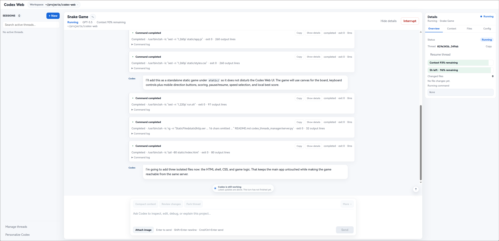

<p align="center">
  
</p>

<h1 align="center">Codex Web</h1>

<p align="center">
  A local Codex web workspace for managing threads, chatting with Codex, inspecting context, and safely preparing AGENTS.md updates.
</p>

## Demo



## What It Provides

Codex Web brings the everyday Codex workflow into a local browser interface:

- **Chat Workspace**: chat with Codex in the current thread, start new threads, attach images, compact context, review changes, and fork threads.
- **Thread Navigator**: quickly search and switch active threads from the left sidebar, with local rename, pin, archive, hide, and restore actions.
- **Manage threads**: use an overlay to manage Active / Archived / Hidden / All threads when you need broader cleanup.
- **Details Inspector**: inspect the current thread status, thread id, time window, context usage, changed files, running command, and configuration.
- **Context Inspector**: understand where context is being spent, including top categories and largest contributors when attribution is available.
- **Diff rendering**: file changes are shown as readable diffs in the chat flow and preview surfaces.
- **Personalize Codex**: run a temporary Codex analysis over past threads and turn repeated workflow patterns into reviewable AGENTS.md suggestions.

Thread rename, archive, hide, restore, and pin are local metadata operations. They do not delete Codex threads and do not call Codex rename/delete/archive APIs.

## Requirements

You need:

- Python 3.11+
- The `codex` CLI installed and logged in locally
- Existing local Codex data under `~/.codex`

By default, Codex Web reads:

- `~/.codex/state_5.sqlite`
- `~/.codex/sessions`
- `~/.codex/archived_sessions`

## Start

Use the helper script:

```bash
./run.sh start
```

Open:

```text
http://127.0.0.1:3217
```

Common commands:

```bash
./run.sh status
./run.sh restart
./run.sh stop
```

To bind only to localhost or use a different Codex data directory:

```bash
python3 -m codex_threads_manager.server --host 127.0.0.1 --port 3217 --codex-home ~/.codex
```

## How To Use

### Chat With Codex

1. Pick an existing thread from the left sidebar, or click `+ New` to start a new one.
2. Choose the project path, model, reasoning effort, and fast mode.
3. Type a message in the composer and send it.
4. Attach images when the task needs visual input.
5. Use `Compact context` when the conversation is getting large.
6. Use `Review changes` when you want Codex to inspect the current code changes.
7. Use `Fork thread` when you want to branch from the current conversation.

### Manage Threads

The left sidebar is for daily navigation:

- Search active threads
- Open a thread
- Rename a thread locally
- Pin important threads
- Archive completed threads
- Hide threads you do not want in the sidebar

Use `Manage threads` for broader cleanup:

- View Active / Archived / Hidden / All threads
- Search historical threads
- Restore threads from Archived or Hidden
- Batch archive / hide / restore / pin selected threads
- Filter by project and sort the list

### Inspect The Current Thread

Open the right Details Inspector to see:

- Current status
- Thread id
- Context usage
- Time window remaining
- Changed files
- Running command
- Context contributors
- Current thread configuration

### Personalize Codex

Use `Personalize Codex` to let Codex summarize durable working preferences from past threads.

The flow is review-first:

1. Choose a learning scope: current project, all projects, selected threads, or the last 30 days.
2. Choose whether Active / Archived / Hidden threads are included.
3. Codex runs a temporary analysis task. It does not create a normal thread.
4. Review each suggestion after the analysis completes.
5. Edit, deselect, ignore, or choose Global / Project AGENTS.md for each rule.
6. Preview the exact diff before writing.
7. Click `Apply changes` only when you are ready to update AGENTS.md.

Codex Web never writes AGENTS.md automatically.
